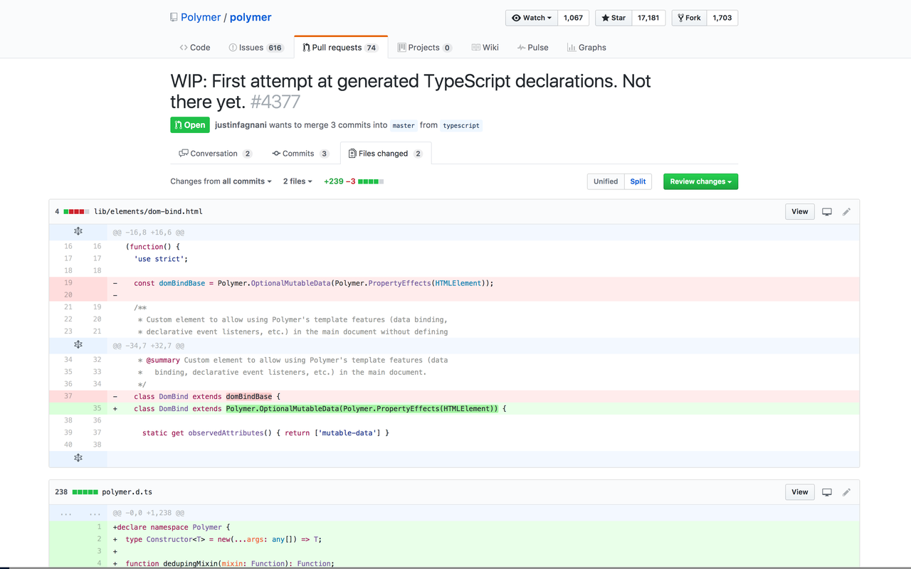

# GitHub Widebody Chrome Extension

Just a simple Chrome Extension that lets you adjust the width of the GitHub Files changed code diff containers.

[Get it on the Chrome Web Store](https://chrome.google.com/webstore/detail/github-widebody/ajbcedleknibpajeigmonepokjcjamak)

## Contributors
